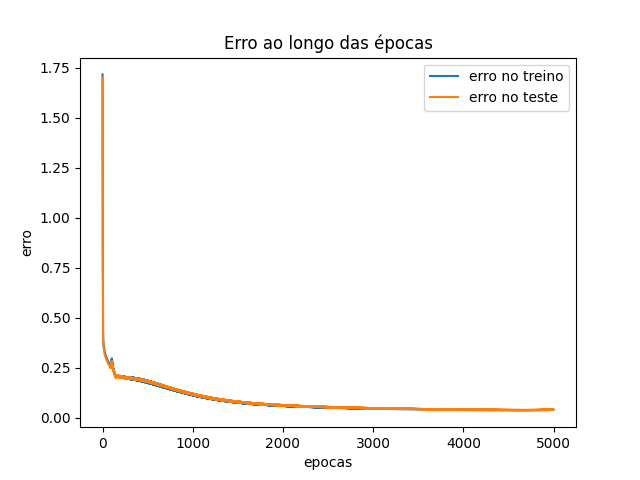
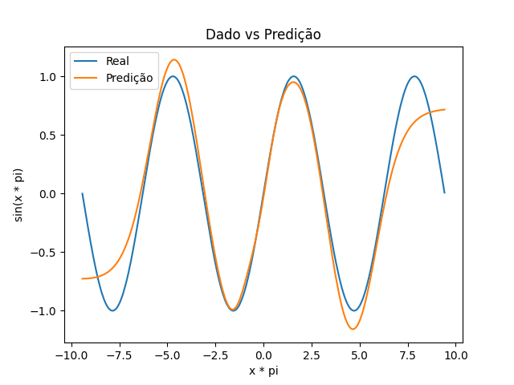

# TE05253 - Redes Neurais Artificiais
Prof. Dra. Adriana Rosa Garcez Castro

Por [Diego Dantas](https://github.com/diegodantasf), [Gustavo Fontenele](https://github.com/gustavofont) e [Jeremias Abreu](https://github.com/j-abreu)

## Implementação simples do Algoritmo BackPropagation com Gradiente Descendente

O algoritmo BackProgation, também chamado apenas de BackProp, foi demonstrado pela primeira vez por [(Rumelhart et al., 1986a)](https://www.nature.com/articles/323533a0) e é, hoje em dia, amplamente utilizado para treinar redes neurais _feedforward_, porém, existem diversas versões deste algoritmo para treinar outros tipos de redes neurais artificiais.

Neste trabalho, apresentamos uma implementação em Python de uma versão simplificada do algoritmo. Foi utilizado um conjunto de dados sintético gerado pelos próprios autores para treino e validação de um Perceptron Multi-Camadas (MLP), usando o algoritmo backprop com o algoritmo do Gradiente Descendente para a atualização do pesos da MLP baseada no erro, o qual é calculado usando a função de Mean Squared Error (erro quadrático médio).

O código fonte do algoritmo pode ser encontrado [neste repositório](https://github.com/diegodantasf/ufpa-rna-backprop).

Os dados usados para treino e validação foram gerados a partir de funções elementares, mais especificamente função f(x) = sen(x). Usamos 1000 amostas para o treino e validação. A MLP foi treinada por 5000 épocas. Logo abaixo mostramos os graficos de erro ao longo das épocas e de validação mostrando o resultado esperado e o resultado da MLP.

  
  
Erro ao longo do treinamento com 5000 épocas da MLP

  
  
Predição vs Valor real

A aplicação escolhida para a rede MLP implementada tem como objetivo validar a implementação e demonstrar a capacidade de aproximação de uma MLP com apenas uma camada oculta. Pelos os graficos, foi observado que a implementação esta otimizando os pesos da rede e que a MLP conseguiu se aproximar da função seno. 

## Referências 

[(Rumelhart et al., 1986a)](https://www.nature.com/articles/323533a0)

[Neural Networks, Multilayer Perceptron and the Backpropagation Algorithm](https://medium.com/@tiago.tmleite/neural-networks-multilayer-perceptron-and-the-backpropagation-algorithm-a5cd5b904fde)

[Deep Learning Book](https://www.deeplearningbook.com.br/algoritmo-backpropagation-parte1-grafos-computacionais-e-chain-rule/)
